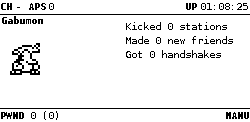

# Digivice VPet V1 plugin for Pwnagotchi

 


---

## Features

- **Choose your starter Digimon**: Agumon, Betamon, Gabumon, or Random.
- **Evolve based on experience (XP)** earned from deauths, handshakes, and associations.
- **Multi-stage evolution** with different paths depending on your digimons activity.
- **Custom faces** for each Digimon stage.
- **On-screen XP bar and stats** to track your Digimon’s progress.
- **Configurable settings** via Pwnagotchi’s config.
- **Automatic evolution and restarts** when conditions are met.
- **Life-span mechanic** to reset and start fresh after a set number of days.
- **Scaled difficulty** based on age.
---

## How XP Works

| Action       | XP Gained  |
|-------------|-----------|
| Deauth      | 1.2 XP    |
| Handshake   | 1.5 XP    |
| Association | 0.8 XP    |

- **Rookie Evolution Requirement**: `1500 XP`
- **Champion Evolution Requirement**: `3000 XP`
- **Life-span Reset**: `15+ Days` (Can be customized)

---

## Evolution Paths

### **Rookie Evolution**
After reaching **1500 XP**, your Digimon can evolve into different **Champion** forms based on hacking activity.

| Rookie    | Evolution Options | Requirements |
|-----------|------------------|-------------|
| **Agumon**  | Greymon  | `40 Deauths` + `80 Handshakes` |
|           | Tyrannomon  | `70 Handshakes` |
|           | Devimon  | `50 Deauths` |
|           | Meramon  | `800 Associations` |
|           | Numemon  | **Random chance** |
| **Betamon**  | Devimon  | `40 Deauths` + `80 Handshakes` |
|           | Meramon  | `70 Handshakes` |
|           | Airdramon  | `50 Deauths` |
|           | Seadramon  | `800 Associations` |
|           | Numemon  | **Random chance** |
| **Gabumon** | Garurumon  | `40 Deauths` + `80 Handshakes` |
|           | Kabuterimon  | `90 Handshakes` |
|           | Numemon  | **Random chance** |

### **Champion Evolution**
After reaching **3000 XP**, your Digimon can evolve into **Ultimate** forms.

| Champion | Evolution | Requirements |
|----------|-----------|-------------|
| **Greymon** | Metal Greymon | `60 Deauths` + `120 Handshakes` |
| **Garurumon** | Metal Garurumon | `1200 Associations` + `120 Handshakes` |
| **Kabuterimon** | Skull Greymon | `110 Handshakes` |
| **Tyrannomon** | Mamemon | `110 Handshakes` |
| **Meramon** | Mamemon | `1300 Associations` |
| **Seadramon** | Mamemon | `1300 Associations` |
| **Devimon** | Metal Greymon | `60 Deauths` + `120 Handshakes` |
| **Airdramon** | Metal Greymon | `60 Deauths` + `120 Handshakes` |
| **Numemon** | Monzaemon | `1300 Associations` + `60 Deauths` |


<sub><em>Note: All requirements are scaled based on Digimon age. Numemon has 20% random chance if conditions not met.</em></sub>

---


## Config Options.

```
main.plugins.digivice.enabled = true
main.plugins.digivice.starter = "random"          # Choose starting Digimon agumon, betamon, gabumon, or random.
main.plugins.digivice.xpbar_position = "53,64"    # XP Bar Position
main.plugins.digivice.digistats = true            # Show Auth, Deauth and Handshake counters, Frames and Age.
main.plugins.digivice.life_span = 10              # After this many days digimon will revert to starter digimon.
```

## Config Options.
```
ui.faces.look_r = "/custom-faces/agumon/look_r.png"
ui.faces.look_l = "/custom-faces/agumon/look_l.png"
ui.faces.look_r_happy = "/custom-faces/agumon/look_r_happy.png"
ui.faces.look_l_happy = "/custom-faces/agumon/look_l_happy.png"
ui.faces.sleep = "/custom-faces/agumon/sleep.png"
ui.faces.sleep2 = "/custom-faces/agumon/sleep2.png"
ui.faces.awake = "/custom-faces/agumon/awake.png"
ui.faces.bored = "/custom-faces/agumon/bored.png"
ui.faces.intense = "/custom-faces/agumon/intense.png"
ui.faces.cool = "/custom-faces/agumon/cool.png"
ui.faces.happy = "/custom-faces/agumon/happy.png"
ui.faces.excited = "/custom-faces/agumon/excited.png"
ui.faces.grateful = "/custom-faces/agumon/grateful.png"
ui.faces.motivated = "/custom-faces/agumon/motivated.png"
ui.faces.demotivated = "/custom-faces/agumon/demotivated.png"
ui.faces.smart = "/custom-faces/agumon/smart.png"
ui.faces.lonely = "/custom-faces/agumon/lonely.png"
ui.faces.sad = "/custom-faces/agumon/sad.png"
ui.faces.angry = "/custom-faces/agumon/angry.png"
ui.faces.friend = "/custom-faces/agumon/friend.png"
ui.faces.broken = "/custom-faces/agumon/broken.png"
ui.faces.debug = "/custom-faces/agumon/debug.png"
ui.faces.upload = "/custom-faces/agumon/upload.png"
ui.faces.upload1 = "/custom-faces/agumon/upload1.png"
ui.faces.upload2 = "/custom-faces/agumon/upload2.png"
ui.faces.png = true
ui.faces.position_x = 0
ui.faces.position_y = 26

```

## Optional. 
```
ui.fps = 1
```


---


❤️ Credits and Thanks.


Akiyoshi Hongo, Bandai, Pwnagotchi devs, airshuffler for the sprites and everyone else who made their plugins public. 


---


