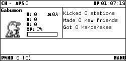
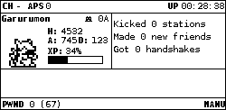
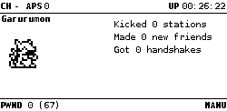

# Digivice – A Digimon Evolution Plugin for Pwnagotchi  

   


Turn your Pwnagotchi into a digital monster with **Digivice Plugin**, a plugin inspired by classic Digivices! Just like in the old-school Digimon toys, your Pwnagotchi will gain experience (EXP), grow older, and evolve into different forms based on its activity.  

---

## Features  

- **EXP System** – Earn EXP from handshakes, associations, and deauthentication attacks.  
- **Evolution Paths** – Start with **Agumon** or **Gabumon**, then evolve into:  
  - Greymon, MetalGreymon  
  - Garurumon, Metal Garurumon  
  - Numemon, Monzaemon  
  - Kabuterimon, Skull Greymon  

- **Live Stats** – Displays your Digimon’s **form, age, EXP bar, and handshake count** in the UI.  
- **Auto-Saving & Config Updates** – Tracks progress and updates `config.toml`.  
- **Auto-Restart on Evolution** – Ensures smooth transitions when evolving.  
- **Evolution Reset** – Every **5 days**, your Digimon resets to an either Agumon or Gabumon for a fresh start.  

---

## Evolution Rules  

### At 2 Days Old  
| Starting Form | Evolution (EXP ≥ 500) | Evolution (EXP ≤ 499) |
|--------------|--------------------|--------------------|
| Agumon      | Greymon            | Numemon            |
| Gabumon     | Kabuterimon        | Garurumon          |

### At 1000 EXP  
| Current Form  | Evolution |
|--------------|-----------|
| Greymon     | Metal Greymon |
| Numemon     | Monzaemon |
| Kabuterimon | Skull Greymon |
| Garurumon   | Metal Garurumon |

---


## Config Options.

```
main.plugins.digivice.enabled = true
main.plugins.digivice.starter = "random"          # Choose starting Digimon 'agumon', 'gabumon', or 'random'
main.plugins.digivice.xpbar = true                # Show Exp and Exp bar.
main.plugins.digivice.xpbar_position = "53,62"    # XP Bar Position
main.plugins.digivice.digistats = true            # Show Auth, Deauth and Handshake counters, Frames and Age.
main.plugins.digivice.sessionstats = false        # True = Session based stats  False = Persistent Stats 


ui.faces.look_r = "/custom-faces/agumon/look_r.png"
ui.faces.look_l = "/custom-faces/agumon/look_l.png"
ui.faces.look_r_happy = "/custom-faces/agumon/look_r_happy.png"
ui.faces.look_l_happy = "/custom-faces/agumon/look_l_happy.png"
ui.faces.sleep = "/custom-faces/agumon/sleep.png"
ui.faces.sleep2 = "/custom-faces/agumon/sleep2.png"
ui.faces.awake = "/custom-faces/agumon/awake.png"
ui.faces.bored = "/custom-faces/agumon/bored.png"
ui.faces.intense = "/custom-faces/agumon/intense.png"
ui.faces.cool = "/custom-faces/agumon/cool.png"
ui.faces.happy = "/custom-faces/agumon/happy.png"
ui.faces.excited = "/custom-faces/agumon/excited.png"
ui.faces.grateful = "/custom-faces/agumon/grateful.png"
ui.faces.motivated = "/custom-faces/agumon/motivated.png"
ui.faces.demotivated = "/custom-faces/agumon/demotivated.png"
ui.faces.smart = "/custom-faces/agumon/smart.png"
ui.faces.lonely = "/custom-faces/agumon/lonely.png"
ui.faces.sad = "/custom-faces/agumon/sad.png"
ui.faces.angry = "/custom-faces/agumon/angry.png"
ui.faces.friend = "/custom-faces/agumon/friend.png"
ui.faces.broken = "/custom-faces/agumon/broken.png"
ui.faces.debug = "/custom-faces/agumon/debug.png"
ui.faces.upload = "/custom-faces/agumon/upload.png"
ui.faces.upload1 = "/custom-faces/agumon/upload1.png"
ui.faces.upload2 = "/custom-faces/agumon/upload2.png"
ui.faces.png = true
ui.faces.position_x = 0
ui.faces.position_y = 26

```


---


❤️ Credits and Thanks.


Akiyoshi Hongo, Bandai, Pwnagotchi devs, airshuffler for the sprites and everyone else who made their plugins public. 


---


